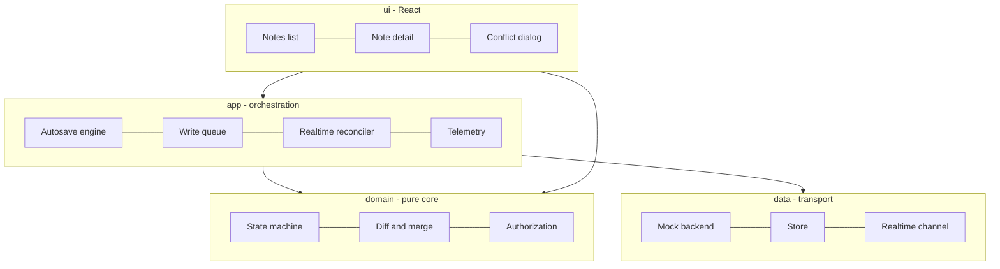
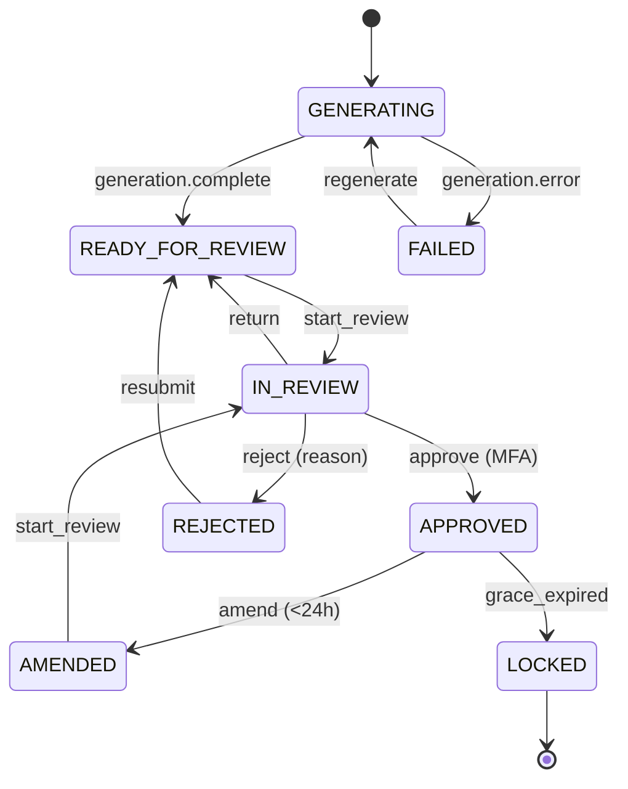

# Soulside — AI-Assisted Clinical Notes Workflow

A frontend for reviewing AI-drafted clinical notes. A note is generated from a
recorded session, a licensed reviewer refines it, and it moves through a strict
lifecycle — draft → review → approved → locked — before it becomes part of the
patient record. The surface has to stay honest with the server under
concurrency, survive a flaky or absent network, and scale to a list of hundreds
of thousands of notes without losing an edit or misfiring a state transition.

This README is the design document. It explains where state lives, how the note
lifecycle is modelled, how conflicts are resolved without data loss, and the
trade-offs behind each choice. The code is organised so the reasoning maps
directly onto modules.

> Context: this is the frontend half. Soulside's backend assignment ingests
> meeting *transcripts*; those transcripts are the raw material an AI turns into
> the draft notes this app reviews. The two are separate repos with no shared
> code — the link is the product story, not an integration.

---

## Build & run

Requires Node 20+.

```bash
npm install
npm run dev        # start the app (Vite) at http://localhost:5173
npm run build      # typecheck + production build
npm test           # run the full test suite (Vitest)
npm run typecheck  # tsc --noEmit, strict
```

There is no separate backend to start: the app runs against an in-process **mock
backend** that simulates the REST endpoints (100–800 ms latency, ~5 % injected
failures), a mock real-time channel, and a deterministic seed of 5,000 notes.
Everything is local and reproducible.

Use the **Acting as** selector in the top bar to switch role
(CLINICIAN / REVIEWER / ADMIN / READONLY_AUDITOR) and watch the available
actions change — every affordance is a function of `(role, status, ownership)`.

---

## Architecture overview

The guiding rule is **one-way dependency direction**. Four layers, each
importing only from the layers beneath it:

```
ui/      React components. Import app/ and domain/. No transport, no I/O.
app/     Orchestration: autosave, write queue, reconciler, telemetry, runtime.
domain/  Pure core: state machine, diff, merge, authz, types. Imports NOTHING.
data/    Transport: mock backend, store, cursor, realtime channel.
```

`domain/` is a sink — it imports nothing from the rest of the app, has no I/O,
no clock, no framework. That single constraint is what lets me claim the data
layer, the transport, or even the UI framework could be replaced without
rewriting the business rules, and it's why the domain modules are trivially
unit-testable.



The one composition root is `app/runtime.ts`. It constructs the concrete backend
and every engine once and hands them to the UI as a set of interfaces
(`NotesApi` and friends). Components never see `MockBackend`; they see the
interface, so the real server is a drop-in.

---

## The ten design decisions

### 1. State topology — where state lives

State is deliberately split by ownership and lifetime, not dumped into one store:

- **Server/cache state** (the notes, versions, events) lives in **TanStack
  Query**, keyed by the serialized URL query. Query owns fetching, caching,
  cursor pagination and staleness. I did not put this in a global store because
  server state has different rules from UI state — it can be refetched, it can
  go stale, and it benefits from request de-duplication and background
  refresh that a hand-rolled store would have to reinvent.
- **URL state** (filters, sort, search) lives in the URL and is the source of
  truth for the list view. It doubles as the query key, so deep-linking is free
  and a changed query can't be clobbered by a stale in-flight response.
- **Ephemeral UI state** (bulk selection) lives in a small **Zustand** store,
  because it must survive rows unmounting during pagination and filtering —
  it can't live in row component state.
- **Effectful machine state** (an open note's autosave/conflict status, the
  write queue, the reconciler's view) lives in the `app/` engines, which expose
  observable state the components subscribe to.

Trade-off: three state mechanisms instead of one is more concepts to learn, but
each is the right tool for its lifetime, and the boundaries are clean. A single
mega-store would blur server truth, URL, and local intent together — exactly the
seam where staleness bugs live.

### 2. State machine — the note lifecycle

`domain/machine.ts` is the heart of the app. The lifecycle
(`GENERATING → READY_FOR_REVIEW → IN_REVIEW → APPROVED → LOCKED`, plus
`FAILED`, `REJECTED`, `AMENDED`) is a first-class, pure, unit-tested module. The
full transition table from the brief is transcribed as data (`RULES`), and every
question — "can this actor do this?", "what's the next state?", "what actions
should the toolbar show?" — is answered by one function each.

Two decisions make it work:

- **`can()` returns a reason, not a boolean.** A denial is
  `{ allowed: false, code, reason }` with a human-readable sentence. This is what
  lets the action bar render a *disabled button that explains itself* ("You are
  not the assigned reviewer") without a single status `if` in the component. A
  test asserts every denial across all statuses × roles yields a real sentence,
  so the requirement can't silently regress.
- **Server-pushed transitions run through the same machine.** `applyServerTransition`
  adopts the server's status (the server is authoritative) but classifies the
  result as `applied` / `no-op` / `violation`. Duplicates become no-ops
  (at-least-once safety); genuine drift is reported, never silently swallowed.

The machine is clock-free: `now` is injected, so grace-period and MFA-freshness
logic is deterministic in tests.



### 3. Optimistic updates — apply then reconcile

User actions update the client immediately and reconcile with the server
response. A transition is validated against the machine *before* any API call,
so an illegal action never leaves the client. On the wire, a rejection (invalid
state, stale version, permission, MFA) rolls the UI back and surfaces the
reason. For edits, the autosave engine emits an optimistic local state and only
advances the base version when the server acks.

The general principle: the machine is the gate, the server is the judge, and the
UI always shows *why* when the judge disagrees.

### 4. Concurrency — conflicts without data loss

Every save carries `baseVersionId` and a `clientMutationId`. The autosave engine
(`app/autosave.ts`) guarantees:

- **Single-flight**: never two concurrent POSTs for one note. Edits made during
  a save become a single coalesced follow-up (the latest content wins), not a
  pile of racing requests.
- **Idempotent retries**: one mutation id is reused across all retries of a save,
  so a request the server already received cannot create a duplicate version.
- **Honest conflict**: on a 409 the engine stops and surfaces the server head +
  common ancestor. It never overwrites and never forces a reload.

Resolution is a **three-way merge** (`domain/merge.ts`, a diff3 over word
tokens), per SOAP section. A change on only one side (or the same change on both)
auto-merges silently; only a region both sides changed differently becomes a
conflict showing base / mine / theirs. Per-section granularity means a conflict
in Assessment never forces you to re-resolve an untouched Plan. Crucially, this
same merge surface is reached from **three** directions — an autosave 409, an
offline-replay conflict, and a real-time supersede — through one component with
one contract.

### 5. Offline — a durable write queue

`app/writeQueue.ts` keeps the app usable with no network. Writes are persisted
to **IndexedDB** *before* they count as enqueued, so a crash right after an edit
can't lose it, and the queue survives a full page reload (rehydrated on boot).
Replay drains **FIFO, one at a time**, honouring `baseVersionId`; it stops at the
first conflict or transient error and resumes exactly there on the next
reconnect — no reordering, no skipping. A conflict during replay routes through
the same three-way merge as a live save. Connectivity is a non-modal inline
banner with three distinct states (online / offline-with-N-queued / syncing), so
the user is never uncertain whether their last edit was saved. Storage is behind
an interface, so the logic is tested against an in-memory fake and IndexedDB is a
drop-in.

### 6. Real-time — reconciling pushes with local state

`app/reconciler.ts` merges an at-least-once channel with local optimistic state:

- **Dedupe by `eventId`** through a bounded LRU — duplicates drop and the set
  can't grow without limit across a long session.
- **Order-independent**: a replayed batch is applied in `occurredAt` order, and
  status is adopted from the server regardless of wire order.
- **Event-before-ack**: a `version_added` that echoes our own in-flight save is
  *held* until the save settles, so our own echo isn't mistaken for a concurrent
  supersede.
- **Supersede → merge**: a server version landing mid-edit emits a `supersede`
  effect that opens the three-way merge; a status change that invalidates the
  current edit is flagged for a graceful interrupt, never dropped.

Subscriptions are **ref-counted** and reconcile to the viewport, and reconnect
uses **exponential backoff with jitter** plus a **replay cursor** — on reconnect
we request everything since the last event, because we don't assume the socket
dropped nothing.

### 7. Telemetry — batched, resilient, PII-safe

`app/telemetry.ts` is a single `track()` facade — no component calls the endpoint
directly. Events are batched and flushed on a size threshold, a time threshold,
and session boundaries (route change, tab hidden). Failed batches retry with
backoff and, after N attempts, are **parked in storage** for a later drain
rather than dropped. The final flush on unload uses `sendBeacon`, falling back to
park. The redaction pass is **default-deny**: only allowlisted, primitive,
short-enough values survive, with a denylist backstop for obvious PII keys, and
it runs *before* buffering — so free-text note content cannot reach the wire even
if a caller passes it by mistake. That property is asserted directly in tests.

### 8. Scale — responsive at 100k+ notes

The list never loads everything into memory. It is **cursor-paginated**
(`useInfiniteQuery`), and rows are **virtualized** (`@tanstack/react-virtual`) so
only the visible window renders. The cursor encodes the *sort position*
(an `(updatedAt, id)` keyset), not an offset, so an insert between requests can't
shift pages or drop/duplicate rows — a property proven by walking the full
dataset and asserting no gaps or duplicates. Real-time subscriptions are scoped
to the viewport and ref-counted, so a 500-note scroll session leaves nothing
open. The detail and history views work off a single note's version graph, not
the whole dataset.

### 9. Testing — what I tested and why

221 tests, split by cost and value:

| Level | Where | What |
|---|---|---|
| Unit (pure) | `domain/*.test.ts` | state machine (58), diff (12), merge (12), authz (10) |
| Integration (effectful) | `app/*.test.ts` | autosave (19), write queue (15), reconciler + reconnect (24), telemetry (18) |
| Backend | `data/backend.test.ts` | seeding, cursor pagination, 409, idempotency (34) |
| Scenario | `scenarios.test.ts` | the five required scenarios, end to end (5) |
| Component + URL state | `ui/**/*.test.{ts,tsx}` | action bar, conflict dialog, version history, URL round-trip (14) |

The emphasis is deliberate: the state machine and the pure logic get exhaustive
unit tests (every illegal transition is enumerated and asserted refused); the
racy modules (autosave, offline replay, real-time) get integration tests with
**injected time and randomness**, so there are no flaky real timers anywhere. I
did *not* write heavy end-to-end browser tests — the component tests plus the
scenario integration tests cover the critical flows far more cheaply and
deterministically, and the brief explicitly prefers a small coherent suite. A
Playwright smoke path would be the first thing I'd add with more time.

The five scenario tests match the brief's wording so they can be checked off:
two reviewers colliding, a network drop with three queued mutations and a 20-min
reconnect, a status push arriving before its ack, a resubmit after an admin
superseded the base, and a 500-note session with no leaks.

### 10. Accessibility — WCAG 2.2 AA posture

Target: **WCAG 2.2 AA**. What's implemented:

- **Keyboard**: the app is operable end to end — a skip link to main content,
  visible focus rings (`:focus-visible`), native controls (buttons, checkboxes,
  radios, textareas) throughout, and the conflict dialog is a focus-managed
  `role="dialog"` with `aria-modal`.
- **Screen-reader semantics**: save status, connectivity, and the list count are
  `aria-live="polite"` regions, so changes are announced; sortable columns carry
  `aria-sort`; the diff uses semantic `<ins>`/`<del>` so changes aren't conveyed
  by colour alone; disabled actions carry the reason in their `aria-label`.
- **Status not by colour alone**: every status pill has a text label.

Documented gaps (honest): the conflict dialog traps initial focus but does not
yet implement a full focus *cycle* trap; there is no automated `axe` run in CI;
and colour-contrast has been eyeballed against AA, not formally audited. These
are the first things I'd close for a production release.

---

## Authorization & PII posture

`domain/authz.ts` resolves every affordance through one pure `can(capability,
ctx)`, a function of role × status × ownership. A denial distinguishes
`no-permission` from `not-owner` from `read-only`, because "you may not" and
"there's nothing here" must never look the same to the user. **Client checks are
UX only** — the mock server independently rejects illegal actions, and the UI
handles that rejection, so a forged button click cannot bypass a guard. Note
content never enters telemetry (see §7).

---

## Assumptions

- **`amend` is restricted to CLINICIAN/ADMIN.** The spec gives no role guard for
  `amend`, only the 24-hour window, but an auditor amending an approved clinical
  note would be a compliance defect, so the machine restricts it.
- **`approve`/`reject` retain the assigned reviewer**; `return`/`resubmit`/
  `regenerate` release the lock. The record of who decided is workflow state.
- **MFA freshness is 5 minutes.** The spec requires MFA re-auth to approve; I
  modelled it as a recency check on the actor's last verification.
- Field names from the sample payloads were adapted where convenient but keep
  the same semantics, as the brief permits.

## Known limitations (scoping)

Called out rather than hidden:

- **Offline routing of autosave.** The write queue is fully built, tested, and
  hydrated/replayed on boot, but the editor's autosave currently saves online
  directly rather than funnelling *every* edit through the queue when offline.
  Both paths exist and are tested; unifying them (all writes through the queue,
  with "queued" as a first-class autosave state) is the clean next step.
- **Authorization is enforced at the action level** (the action bar resolves
  through `can()`, and the server independently rejects illegal actions). The
  `authz` module is designed to also back route-level and component-level
  guards, but those wrappers aren't wired into the router yet.
- **Bulk actions** (assign reviewer / request regeneration) are stubbed
  placeholders — the selection plumbing that survives pagination is real, the
  actions themselves are demo handlers.
- **The provided `simulate_workflow.ts` script isn't directly runnable.** It
  drives the backend over HTTP; this mock backend is in-process (no HTTP
  server), which keeps the app dependency-light and the tests fast. To run the
  provided script as-is I'd expose the same handlers over HTTP via MSW or a thin
  Express layer — the store and endpoints are already structured for it. The
  equivalent workflow is instead exercised by the scenario tests.
- No Playwright/E2E suite (see §9).

### Dependency audit

`npm audit` reports 7 advisories; the count is misleading. Six are a single
**esbuild** dev-server issue that npm re-flags up the tree onto `vite` and
`vitest` (hence the "high"/"critical" labels) — it is **dev-tooling only** and
never ships in the production bundle. `npm audit --omit=dev` confirms this,
showing just two moderate advisories in **react-router**: one is SSR-only (this
is a client-side SPA, so it doesn't apply) and the other is an open-redirect via
a backslash in `<Link>`/`useNavigate`, which requires routing to untrusted user
input — this app never does. The only available "fix" bumps Vite 5→8 and
react-router 6→7 (both breaking majors, no patched 6.x exists), so the upgrade is
deferred deliberately rather than destabilizing a green build for low-risk,
mostly-dev advisories.

## What I'd do next

CRDT-based collaborative editing on the existing merge seam; a plugin
architecture for note-type editors (SOAP/DAP/BIRP); correlation IDs threading a
user action through its save, telemetry event and real-time echo; a PWA wrapper
with background sync of the write queue; and the accessibility gaps above.

---

## Project layout

```
src/
  domain/   types, state machine, diff, merge, authz  (pure, no imports)
  data/     mock backend, store, cursor, realtime, rng
  app/      autosave, write queue, reconciler, reconnect, telemetry,
            connectivity, subscriptions, apiClient, runtime
  ui/       React: list, detail, action bar, conflict dialog, hooks, URL state
  scenarios.test.ts   the five required scenarios, end to end
```

The state-machine specification is source-of-truth code: `src/domain/machine.ts`
(the `RULES` table) and `src/domain/machine.test.ts`.
